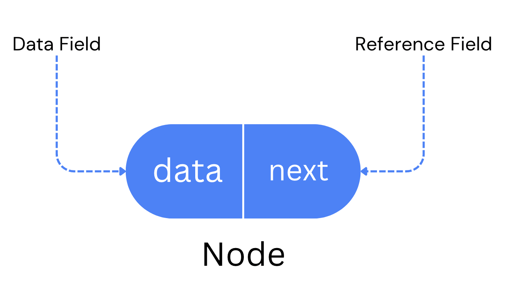
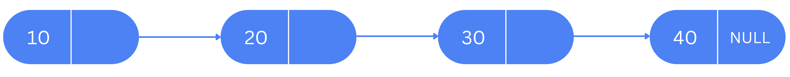
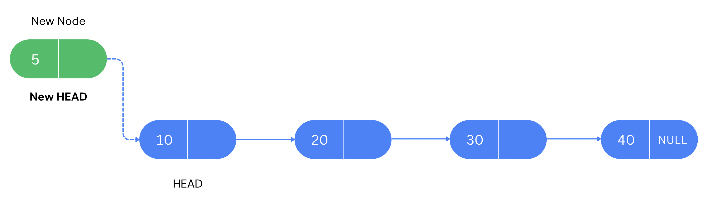
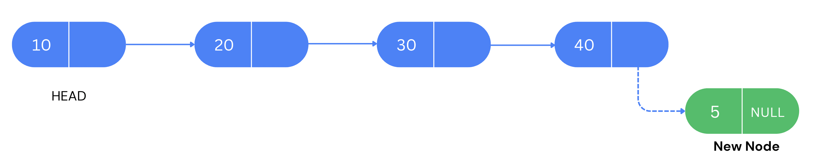
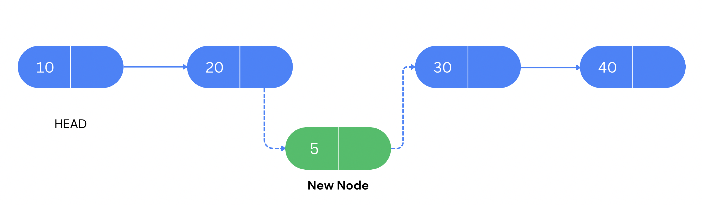

# Singly Linked List using C++

### Introduction to Linked List Data Structure


A linked list is a fundamental data structure in computer science that consists of a sequence of elements, where each element points to the next one in the sequence. Each element in a linked list is called a "node."

## Basic Structure

In a singly linked list, each node contains two fields:

- **Data**: Holds the value of the element.
- **Next**: Points to the next node in the sequence.

```cpp
class Node {
public:
    int data;
    Node* next;

    Node(int val) {
        data = val;
        next = NULL;
    }
};

```

#### Node 

 

#### Singly Linked List Example

 
 
- Node 10 is the head node of the list.
- Node 40 is the tail node of the list.
- Each node is connected in such a way that node 10 is pointing to node 20 which in turn pointing to node 30.
- Node 30 is again pointing to node 40. 
- Node 40 is pointing to null as it is the last node of the list.

### How to create new Linked List ?

```

int main(){
    
    LinkedList linkedList;

    linkedList.insertAtBeginning(40);
    linkedList.insertAtBeginning(30);
    linkedList.insertAtBeginning(20);
    linkedList.insertAtBeginning(10);

    linkedList.traverse();

    return 0;
}

``` 

### Traverse Linked List?

```
    void traverse() {
        Node* current = head;
        while (current != NULL) {
            std::cout << current->data << " ";
            current = current->next;
        }
        std::cout << std::endl;
    }

```


### How to Insert Node in List ?

#### Insert at the beginning of List


```
    void insertAtBeginning(int val) {
        Node* newNode = new Node(val);
        newNode->next = head;
        head = newNode;
    }
```


#### Insert at the end of List



```
    void insertAtEnd(int val) {
        Node* newNode = new Node(val);

        if (head == NULL) {
            head = newNode;
            return;
        }

        Node* current = head;
        while (current->next != NULL) {
            current = current->next;
        }

        current->next = newNode;
    }

```


#### Insert node at given position in list


```
    void insertAtMid(int val, int position) {
        Node* newNode = new Node(val);
        Node* current = head;

        for (int i = 1; i < position - 1 && current != NULL; ++i) {
            current = current->next;
        }

        if (current == NULL) {
            std::cerr << "Invalid position for mid insertion." << std::endl;
            return;
        }

        newNode->next = current->next;
        current->next = newNode;
    }

```
